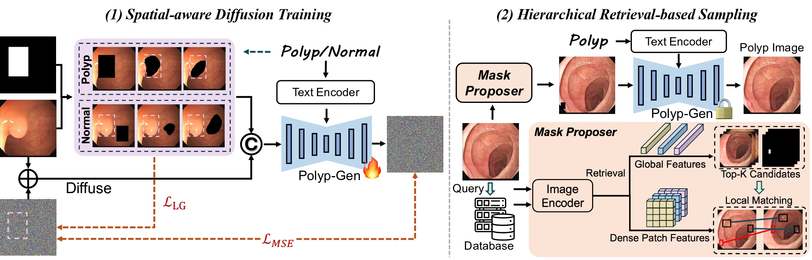
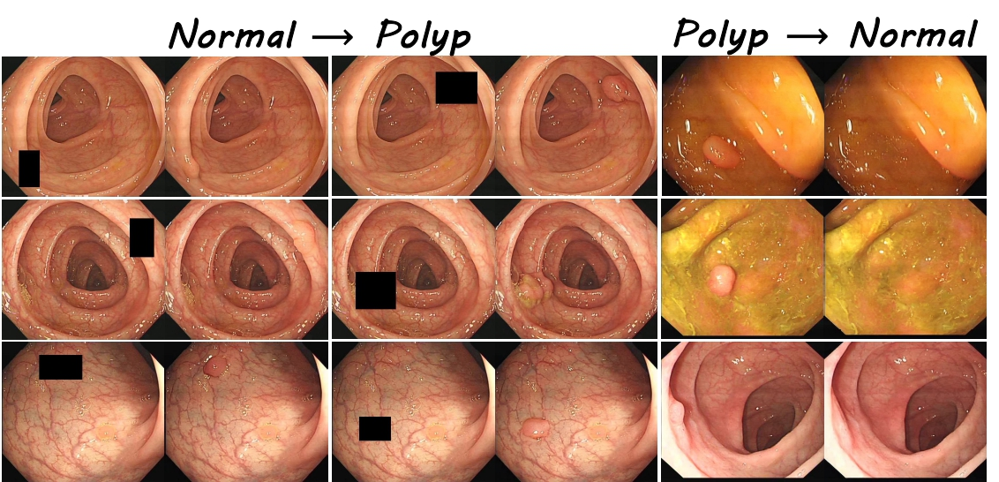
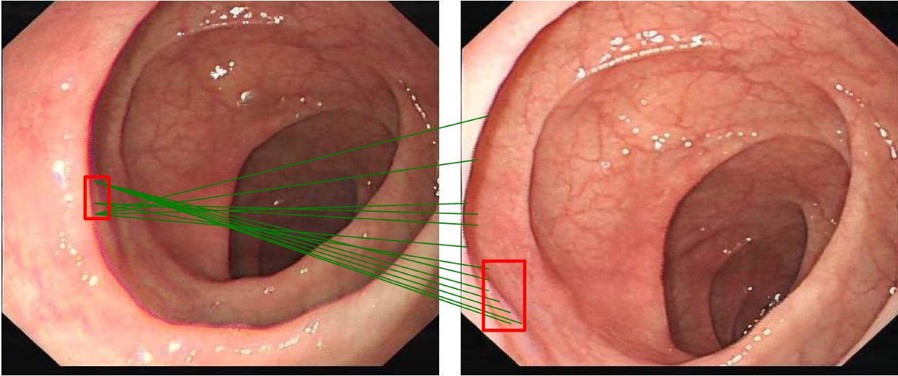

# Polyp-Gen: Realistic and Diverse Polyp Image Generation for Endoscopic Dataset Expansion


## Setup

```bash
git clone https://github.com/Saint-lsy/Polyp-Gen.git
cd Polyp-Gen
conda create -n PolypGen python=3.10
conda activate PolypGen
pip install -r requirements.txt
```

## Data Preparation
This model was trained by [LDPolypVideo](https://github.com/dashishi/LDPolypVideo-Benchmark) dataset.

We filtered out some low-quality images with blurry, reflective, and ghosting effects, and finally select 55,883 samples including 29,640 polyp frames and 26,243 non-polyp frames. 

Our dataset can be downloaded at [here](https://mycuhk-my.sharepoint.com/:u:/g/personal/1155225283_link_cuhk_edu_hk/EXcpsGPTYEBAiIuGOqpRTlQBgzc7uYgrkfP1BLo11_t63w?e=hP9W2g).

## Training
The pre-trained model is Stable Diffusion Inpainting-2, availble on [Huggingface](https://huggingface.co/stabilityai/stable-diffusion-2-inpainting)

You can train your own model using the script:
```bash
bash scripts/train.sh
```
## Sampling

### Checkpoint
You can download the chekpoints of our Polyp_Gen from [here](https://huggingface.co/Saint-lsy/Polyp-Gen-sd2-inpainting/tree/main).
### Sampling with Specified Mask
```bash
python sample_one_image.py
```
### Sampling with Mask Proposer
The weight of pretrained DINOv2 can be found [here](https://github.com/salihmarangoz/dinov2).

The first step is building database and Global Retrieval.
```bash
python GlobalRetrieval.py --data_path /path/of/non-polyp/images --database_path /path/to/build/database --image_path /path/of/query/image/
```
The second step is Local Matching for query image.
```bash
python LocalMatching.py --ref_image /path/ref/image --ref_mask /path/ref/mask --query_image /path/query/image --mask_proposal /path/to/save/mask
```
One Demo of LocalMatching
```bash
python LocalMatching.py --ref_image demos/img_1513_neg.jpg --ref_mask  demos/mask_1513.jpg --query_image  demos/img_1592_neg.jpg --mask_proposal gen_mask.jpg
```



The third step is using the generated Mask to sample.
## Acknowledgements
The code is based on the following projects. Greatly thanks to these authors!
- [Diffusers](https://github.com/huggingface/diffusers)
- [DINOv2](https://github.com/salihmarangoz/dinov2)
